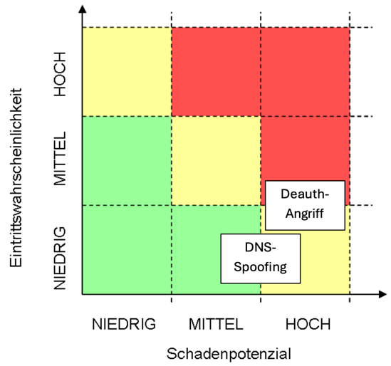

# Man-In-The-Middle Angriff

(kurze Beschreibung abstrakt was hier passiert worum es geht, ...) -> Am Ende einmal machen

# Angriff Extern: Deauthentication Attack

Ein Deauthentication-Angriff zwingt WLAN-Clients aus einem WPA2-Netzwerk heraus, um sie zu einem Rogue-Access-Point (AP) des Angreifers zu locken. Dies nutzt den automatischen Wiederverbindungsmechanismus der Geräte aus, wodurch der Angreifer sensible Daten abfangen oder das Passwort knacken kann.

**Funktionsweise**

- Der Angreifer sendet gefälschte Deauth-Frames an Client oder AP, wodurch die Verbindung abbricht. Clients verbinden sich automatisch mit dem echten Netzwerk zurück. 
- Parallel betreibt der Angreifer (z. B. mit WiFi Pineapple) einen identischen Rogue-AP mit gleichem SSID. 
- Beim 4-Wege-Handshake zum echten AP wird der Traffic umgeleitet; der Angreifer fängt den Handshake (PCAP) ab und knackt das WPA2-Passwort offline via Bruteforce.
- Nach Eintritt ins Netzwerk: Missbrauch der Internetverbindung (z. B. illegale Downloads) oder Folgeangriffe auf Dritte (ARP-Spoofing, DNS-Poisoning).

**Folgen**

- Passwort-Kompromittierung: Vollzugriff auf das WPA2-Netzwerk für den Angreifer. 
- Datendiebstahl: Credentials, Sessions oder IoT-Kommunikation werden über Rogue-AP mitgelesen. 
- Netzwerkmissbrauch: Hohe Traffic-Lasten, illegale Aktivitäten (z. B. Torrents), Angriffe auf interne Systeme. 

## Testumgebung & Aufbau

Einfache WPA2-WLAN-Testumgebung mit Smartphone-Hotspot, vollständig isoliert.

**Verwendete Tools**

| Name               | Zweck              |
| ------------------ | ------------------ |
| Ubuntu 24.04 LTS   | Angreifer-System   |
| WiFi Pineapple MK7 | Deauth + Rogue-AP  |
| Hashcat            | Passwort knacken   |
| Wireshark          | Pakete analysieren |
| Smartphone-Hotspot | Opfer-WLAN         |
| Laptop             | Opfer-Client       |

**IP-Plan:**

- Pineapple: 172.16.42.1 
- Hotspot: 192.168.43.1 
- Client: 192.168.43.x

## Anleitung

- Genaue Schrittweise Anleitung mit Screenshots und Skripten
- Logs vom erfolgreichen Angriff

# Angriff Intern: DNS Spoofing

DNS-Spoofing leitet Clients im lokalen Netzwerk auf gefälschte Webseiten um, indem der Angreifer DNS-Anfragen abfängt und falsche IP-Adressen antwortet. Im Szenario hostet der Angreifer einen eigenen Webserver im Netzwerk, der bei Eingabe von "bank.de" eine Phishing-Seite statt der echten Bank-Website aufruft.

**Funktionsweise**

- Der Angreifer positioniert sich via ARP-Spoofing (z.B. mit arpspoof oder ettercap) als Man-in-the-Middle zwischen Clients und Gateway/DNS-Server. 
- Bei DNS-Anfragen für "bank.de" antwortet der Angreifer mit der eigenen Server-IP (z.B. 192.168.1.100), statt der echten Bank-IP. 
- Clients werden auf den lokalen Fake-Webserver umgeleitet; der Angreifer hostet dort eine identische Phishing-Seite (HTML/JS), die Credentials (Benutzername/Passwort) erfasst und speichert/loggt.

**Folgen**

- Credential-Diebstahl: Bankzugangsdaten, Firmen-Logins oder E-Mail-Passwörter werden gestohlen. 
- Malware-Verteilung: Fake-Seite kann Drive-by-Downloads oder Troyaner einbinden. 
- Interne Eskalation: Mit gestohlenen Credentials greift Angreifer weitere Systeme an (Lateral Movement).

## Testumgebung & Aufbau (IP-Plane, Hardware)

- Welche Tools werden verwendet (kleiner Table)
- Netzwerkplan (wenn benötigt)
- Testumgebungsaufbau
- Konfigurationen (wenn benötigt - nicht zu ausführlich)

## Anleitung

1. Wifi aktivieren im Pineapple 
2. 
2. Pineapple mus weitherin mit Internetn verbunden sein
3. Docker Composen starten (startet backend, das die Credentials Loggt und Frontend starten wo user sich anmelden müssen)
4. Jemand loggt sich in das Rogue AP ein  

- Genaue Schrittweise Anleitung mit Screenshots und Skripten
- Logs vom erfolgreichen Angriff

# Gegenmaßnahmen

## Gegenmaßnahmen gegen Deauthentication-Angriff

### WPA3 Einführen

WPA3 ist der neueste WLAN-Sicherheitsstandard und schützt Management-Frames kryptografisch. Dadurch können Deauth-Frames nicht mehr gefälscht werden, und der 4-Wege-Handshake wird nicht mitgeschnitten.

**Vorteile**

- Vollständiger Schutz vor Deauthentication-basierten MITM-Angriffen 
- Kein verwertbarer Handshake kann mehr abgefangen werden 
- Moderne Business-Access-Points unterstützen WPA3 bereits

**Kosten & Aufwand**

- Einmalige Hardware-Anpassung (neue Access-Points)
- Mehrkosten: 5–15% gegenüber WPA2-Geräten 
- Geringe Konfigurationsarbeit (1–2 Tage)

### Starkes WLAN-Passwort durchsetzen

Lange, komplexe Passwörter (mindestens 16 Zeichen, Sonderzeichen, Zahlen, Groß-/Kleinbuchstaben) sind schwer zu knacken, da sie nicht in Standard-Wortlisten enthalten sind.

**Vorteile**

- Hashcat benötigt deutlich länger zum Bruteforce 
- Kostenlos, keine technische Änderung nötig 
- Breitet auch andere Angriffe ab (z.B. Wörterbuch-Attacken)

**Kosten & Aufwand**

- Einmalige Richtlinie erstellen, sodass immer nur noch Passwörter im entsprechenden Format genutzt werden
- Adminaufwand für Passwortwechsel (vierteljährlich empfohlen) pro Jahr 

## Gegenmaßnahmen gegen DNS-Spoofing

### Port 80 (HTTP) in der Firewall blockieren

Unverschlüsselter HTTP-Verkehr wird auf der Firewall blockiert. Clients können nur noch über HTTPS (Port 443) auf Webseiten zugreifen. Gefälschte Seiten des Angreifers ohne gültiges SSL-Zertifikat werden vom Browser abgelehnt.

**Vorteile**

- DNS-Spoofing bringt dem Angreifer nichts, da HTTP-Verbindungen sowieso blockiert sind 
- Erzwingt verschlüsselte Kommunikation 
- Keine zusätzlichen Kosten, keine Admin-Komplexität

**Kosten & Aufwand**

- Firewall-Regel (5–10 Minuten Konfiguration) - Adminaufwand €

### DNSSEC einführen

DNS-Antworten werden kryptografisch signiert. Der Resolver prüft die Signatur und verwirft gefälschte Antworten automatisch.

**Vorteile**

- Technisch vollständiger Schutz gegen DNS-Manipulation 
- Funktioniert für alle Domains

**Kosten & Aufwand**

- Komplexe initiale Implementierung (mehrere Wochen)
- Hohes Schlüsselmanagement (Key-Rotation, Fehleranalyse)
- Laufender Admin-Aufwand: 3–5 Personentage/Jahr 
- Gesamtaufwand: Hoch (~5.000–10.000 €/Jahr), Nutzen: Sehr hoch aber disproportional 
- Empfehlung: NUR für kritische Infrastrukturen, nicht für KMU ✗

# ROSI

## Ausgangslange & Annahmen

**Firma SWDS (angepasste, plausible Werte):**
- Jahresumsatz: 25 Mio. € 
- Personalkosten: 3 Mio. € 
- Betriebskosten: 6 Mio. € 
- 30 Mitarbeitende in Verwaltung/IT/Office 
- Produktion „Just in Time“ → Ausfallzeiten wirken sich direkt auf Umsatz aus

**Risiko A: Kompromittiertes WLAN (Deauth → Passwort → Einstieg ins Netz)**

- Angreifer nutzt Firmen-WLAN, lädt illegale Inhalte / führt Angriffe durch. 
- Mögliche Folgen:
  - Ermittlungen, Reputationsschaden, IT-Forensik, ggf. Produktionsunterbrechung.

Geschätzter Schaden im Ernstfall: **200.000 €**

- 50.000 € IT-Forensik, Rechtsberatung 
- 50.000 € Produktions-/Betriebsausfall 
- 100.000 € Reputationsschaden / Vertragsverluste (konservativ)

**Risiko B: DNS-Spoofing intern (Fake-Bank-Seite / Fake-Login)**

- Mitarbeitende geben Zugangsdaten ein, Angreifer greift auf Konten / Systeme zu.

Geschätzter Schaden im Ernstfall: **150.000 €**

- 50.000 € direkte finanzielle Verluste / Rückabwicklung 
- 50.000 € Betriebsstörung / Wiederherstellungsaufwand 
- 50.000 € Reputationsschaden

## Risikomatrix

## 

| Name               | Zweck              |
|--------------------| ------------------ |
| Maßnahme           | Angreifer-System   |
| WiFi Pineapple MK7 | Deauth + Rogue-AP  |
| Hashcat            | Passwort knacken   |
| Wireshark          | Pakete analysieren |
| Smartphone-Hotspot | Opfer-WLAN         |
| Laptop             | Opfer-Client       |

# Fazit / Handlungsempfehlung

