# Man-In-The-Middle Angriff

Dieses Projekt demonstriert einen Man-in-the-Middle-Angriff in einer vollständig isolierten Testumgebung.
Zunächst wird ein Deauthentication-Angriff auf ein WPA2-WLAN durchgeführt, um den 4-Wege-Handshake abzufangen und das Passwort offline zu knacken. 
Anschließend wird im internen Netzwerk DNS-Spoofing eingesetzt, um Clients auf eine gefälschte Webseite umzuleiten und Anmeldeinformationen zu stehlen.

Auch werden Gegenmaßnahmen vorgestellt und deren Wirtschaftlichkeit mittels ROSI (Return on Security Investment) bewertet.
Ziel ist die Vermittlung von Angriffs- und Abwehrmechanismen ausschließlich zu Forschungs- und Bildungszwecken in kontrollierter Umgebung.

# Angriff Extern: Deauthentication Attack

Ein Deauthentication-Angriff zwingt WLAN-Clients aus einem WPA2-Netzwerk heraus, um sie zu einem Rogue-Access-Point (AP) des Angreifers zu locken. Dies nutzt den automatischen Wiederverbindungsmechanismus der Geräte aus, wodurch der Angreifer sensible Daten abfangen oder das Passwort knacken kann.

**Funktionsweise**

- Der Angreifer sendet gefälschte Deauth-Frames an Client oder AP, wodurch die Verbindung abbricht. Clients verbinden sich automatisch mit dem echten Netzwerk zurück. 
- Parallel betreibt der Angreifer (z. B. mit WiFi Pineapple) einen identischen Rogue-AP mit gleichem SSID. 
- Beim 4-Wege-Handshake zum echten AP wird der Traffic umgeleitet; der Angreifer fängt den Handshake (PCAP) ab und knackt das WPA2-Passwort offline via Bruteforce.
- Nach Eintritt ins Netzwerk: Missbrauch der Internetverbindung (z. B. illegale Downloads) oder Folgeangriffe auf Dritte (ARP-Spoofing, DNS-Poisoning).

**Folgen**

- Passwort-Kompromittierung: Vollzugriff auf das WPA2-Netzwerk für den Angreifer. 
- Datendiebstahl: Credentials, Sessions oder IoT-Kommunikation werden über Rogue-AP mitgelesen. 
- Netzwerkmissbrauch: Hohe Traffic-Lasten, illegale Aktivitäten (z. B. Torrents), Angriffe auf interne Systeme. 

## Testumgebung & Aufbau

Einfache WPA2-WLAN-Testumgebung mit Smartphone-Hotspot, vollständig isoliert.

**Verwendete Tools**

| Name               | Zweck              |
| ------------------ | ------------------ |
| Ubuntu 24.04 LTS   | Angreifer-System   |
| WiFi Pineapple MK7 | Deauth + Rogue-AP  |
| Hashcat            | Passwort knacken   |
| Wireshark          | Pakete analysieren |
| Smartphone-Hotspot | Opfer-WLAN         |
| Laptop             | Opfer-Client       |

**IP-Plan:**

- Pineapple: 172.16.42.1 
- Hotspot: 192.168.43.1 
- Client: 192.168.43.x


## Anleitung
### 1. Schritt: Pineapple am Angreifer Laptop anschließen

- Website http://172.16.42.1:1471 aufrufen, sobald Licht beim Pineapple dauerhaft Blau leuchtet. 

### 2. Schritt: Einloggen in die Pineapple UI

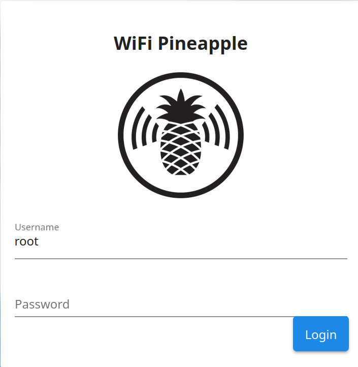

- Auf der Anmeldeseite muss folgendes Passwort eingegeben werden: hak5pineapple 

### 3. Schritt: Scanning nach WLANs

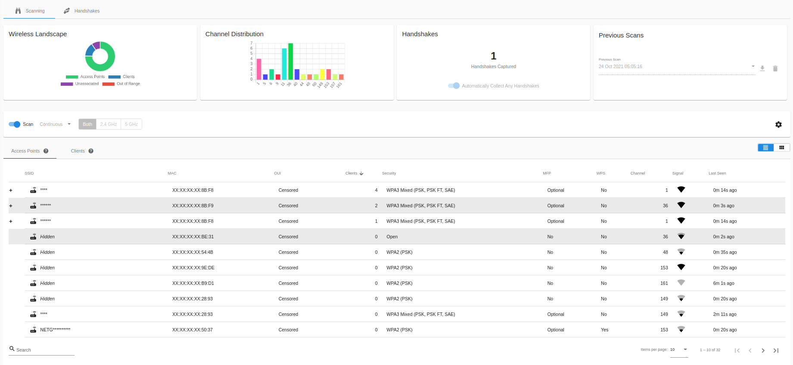

- Auf der Recon-Seite gibt es einen Button "Scan", dieser soll ausgeführt werden, um nach verfügbaren WLANs zu suchen.
- Es wird dann eine Liste mit gefundenen Netzwerken angezeigt mit deren verbundenen Clients.

### 4. Schritt: Deauthentication-Angriff starten

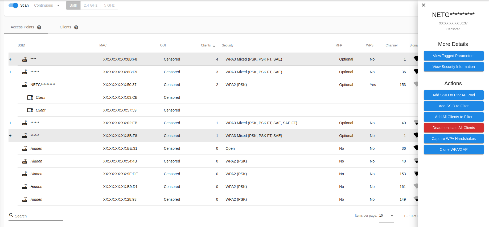

- Nach Auswahl des Zielnetzwerks und der verbundenen Clients, erscheint ein Seitenabschnitt rechts.
- Dort kann der Deauthentication-Angriff gestartet werden, indem auf den Button "Deauthenticate All Clients" geklickt wird.
- nach der Ausführung werden die Clients aus dem Netzwerk getrennt und versuchen sich wieder zu verbinden.


### 5. Schritt: WPA2-Handshake abfangen

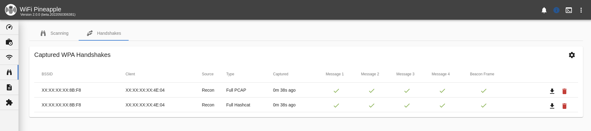

- Sobald sich ein Client wieder mit dem echten Netzwerk verbindet, wird der WPA2-Handshake abgefangen.
- Der erfolgreiche Handshake wird in der Pineapple UI im Handshake Tab angezeigt.
- Die Handshakes werden in PCAP und Hashcat’s 22000 Format gespeichert.

### 6. Schritt: loesung.txt Datei erstellen

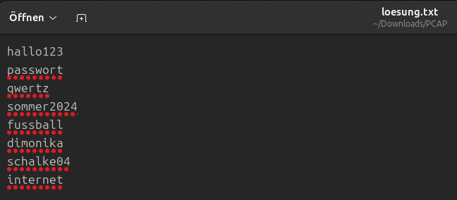

- Um einen Bruteforce-Angriff mit Hashcat durchzuführen, muss eine loesung.txt Datei erstellt werden.
- Diese Datei enthält eine Sammlung von möglichen Passwörtern, die für den Angriff verwendet werden.

### 7. Schritt: WPA2-Passwort mit Hashcat knacken

- Die Datei im 22000 Format wird mit Hashcat und der loesung.txt Datei verwendet, um das WPA2-Passwort zu knacken.
- die .22000 Datei und die loesung.txt Datei müssen im selben Verzeichnis liegen.
- Dann muss folgender Befehl im Terminal ausgeführt werden:
```bash
hashcat -m 22000 B6_E9_FA_BC_E4_51_46_C0_8E_E8_A9_AA_full.22000 loesung.txt
```

### 8. Schritt: Erfolgreich geknacktes Passwort verwenden

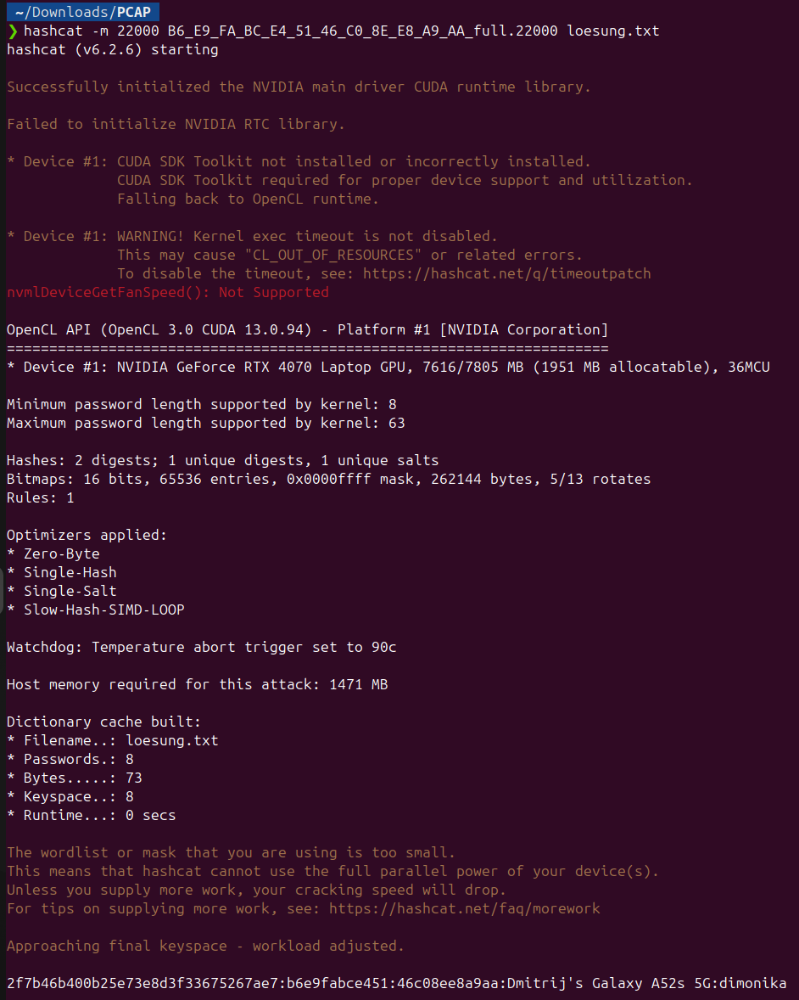

- Nach erfolgreichem Knacken des Passworts wird dieses im Terminal angezeigt.


  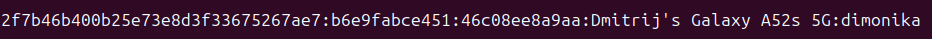
- Das Passwort wird aus dem Terminal nun entnommen an folgender Stelle:
```
  [Hash]:[Mac-Adresse 1]:[Mac-Adresse 2]:[WLAN-Name]:[Geknacktes Passwort]
```
- In diesem Fall ist das geknackte Passwort: `dimonika`


# Angriff Intern: DNS Spoofing

DNS-Spoofing leitet Clients im lokalen Netzwerk auf gefälschte Webseiten um, indem der Angreifer DNS-Anfragen abfängt und falsche IP-Adressen antwortet. Im Szenario hostet der Angreifer einen eigenen Webserver im Netzwerk, der bei Eingabe von "bank.de" eine Phishing-Seite statt der echten Bank-Website aufruft.

**Funktionsweise**

- Der Angreifer positioniert sich via ARP-Spoofing (z.B. mit arpspoof oder ettercap) als Man-in-the-Middle zwischen Clients und Gateway/DNS-Server. 
- Bei DNS-Anfragen für "bank.de" antwortet der Angreifer mit der eigenen Server-IP (z.B. 192.168.1.100), statt der echten Bank-IP. 
- Clients werden auf den lokalen Fake-Webserver umgeleitet; der Angreifer hostet dort eine identische Phishing-Seite (HTML/JS), die Credentials (Benutzername/Passwort) erfasst und speichert/loggt.

**Folgen**

- Credential-Diebstahl: Bankzugangsdaten, Firmen-Logins oder E-Mail-Passwörter werden gestohlen. 
- Malware-Verteilung: Fake-Seite kann Drive-by-Downloads oder Troyaner einbinden. 
- Interne Eskalation: Mit gestohlenen Credentials greift Angreifer weitere Systeme an (Lateral Movement).

## Testumgebung & Aufbau (IP-Plane, Hardware)

- Welche Tools werden verwendet (kleiner Table)
- Netzwerkplan (wenn benötigt)
- Testumgebungsaufbau
- Konfigurationen (wenn benötigt - nicht zu ausführlich)

### Benötigte Tools 
| Kategorie | Tool / Komponente | Zweck |
|-----------|-------------------|-------|
| Hardware | WiFi Pineapple | Bereitstellung des Rogue Access Points und zentrale Netzwerksteuerung |
| Hardware | Client Laptop | Simulation eines Endgeräts im Rogue-Netzwerk |
| Webserver | Docker-Container (Flask) | Auslieferung der simulierten Login-Seite |
| DNS | dnsmasq (Pineapple) | Zentrale DNS-Auflösung im Rogue-Netzwerk |
| Analyse | nslookup | Überprüfung der DNS-Auflösung |

### Netzwerkdiagramm
```
┌─────────────────────────────────┐
│       Test-Client (macOS)       │
│      IP: 172.16.42.10           │
│      DNS: 172.16.42.1           │
│      Gateway: 172.16.42.1       │
└───────────────┬─────────────────┘
                │ WLAN
                │ ① DNS Query: google.com?
                │ ② DNS Response: 172.16.42.138
                ▼
┌─────────────────────────────────┐
│       WiFi Pineapple            │
│      IP: 172.16.42.1            │
│      DHCP Server: aktiv         │
│      DNS Server: dnsmasq        │
│      DNS Spoofing: aktiv        │
└───────────────┬─────────────────┘
                │ LAN
                │ ③ HTTP Request
                ▼
┌─────────────────────────────────┐
│       Webserver (Docker)        │
│      IP: 172.16.42.138          │
│      Port: 80 (HTTP)            │
│      App: Flask Fake Login      │
└─────────────────────────────────┘
```
### Testumgebung
- Der WiFi Pineapple stellt ein offenes WLAN als Rogue Access Point bereit 
- Clients verbinden sich direkt mit diesem WLAN 
- Der WiFi Pineapple fungiert als zentrale Netzwerk- und DNS-Instanz 
- Ein separater Webserver ist im selben Netzwerk eingebunden 
- DNS-Anfragen der Clients werden innerhalb des Rogue-Netzwerks verarbeitet 
- Bestimmte Domainanfragen werden gezielt auf den Webserver aufgelöst 

## Anleitung
### 1. Schritt: Erstellung eines Rogue Access Points

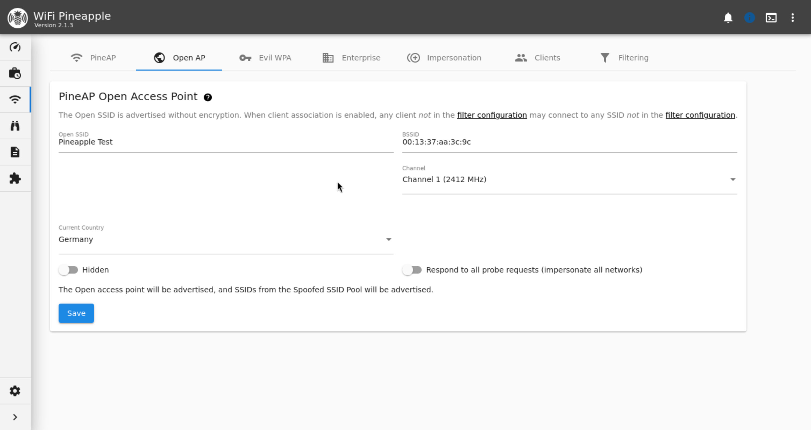

- Verbindung des WiFi Pineapple mit dem Steuerungsrechner 
- Zugriff auf die grafische Benutzeroberfläche des WiFi Pineapple 
- Anlegen eines offenen Access Points
- Vergabe einer SSID, die dem Namen des zu imitierenden WLANs entspricht 

### 2. Schritt: Bestimmung der Netzwerkparameter des Webservers 
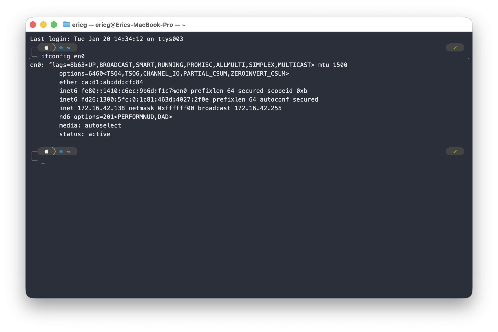

- Verbindung eines Systems mit dem erstellten Rogue Access Point 
- Überprüfung der zugewiesenen Netzwerkschnittstelle 
- Ermittlung der automatisch vergebenen IP-Adresse 
- Nutzung dieser Informationen als Grundlage für die weitere Netzwerkintegration 

### 3. Schritt: Einbindung eines Webservers in das erstellte Netzwerk
- Betrieb des Webservers im selben Netzwerksegment wie die verbundenen Clients 
- Bereitstellung einer vorbereiteten Landing Page auf dem Webserver 
- Simulation einer legitimen Netzwerkseite durch statische Inhalte und definierte Skripte 

### 4. Schritt:DNS-Umleitung über den WiFi Pineapple
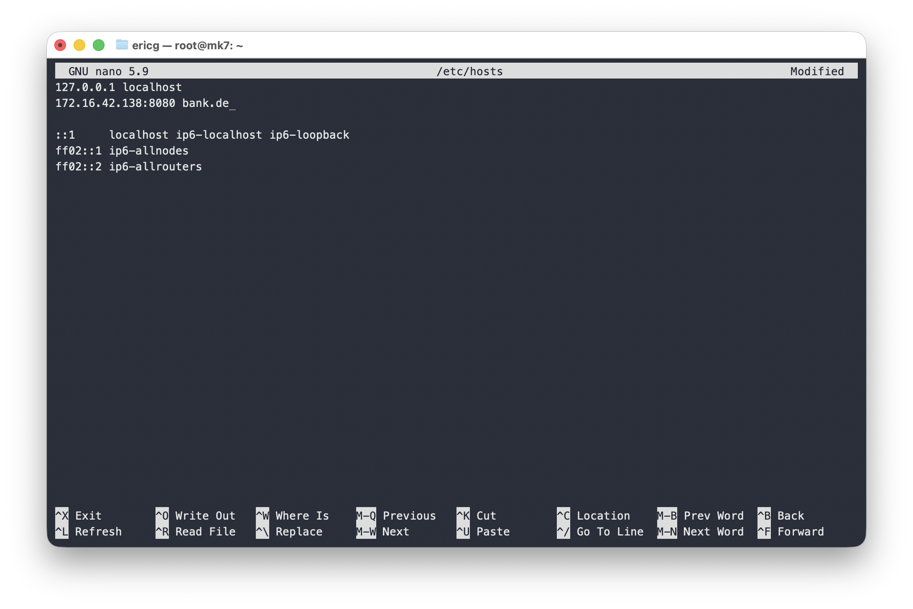

- Die DNS-Zuordnung wird zentral auf dem WiFi Pineapple gesteuert 
- In der Datei /etc/hosts des WiFi Pineapple wird eine statische Zuordnung definiert 
- In diesem Projekt wird der Domainname bank.de auf die IP-Adresse des eingerichteten Webservers aufgelöst 
- DNS-Anfragen der Clients an bank.de werden dadurch automatisch an den Webserver weitergeleitet 

### 5. Schritt:  Aktivierung der DNS-Konfiguration
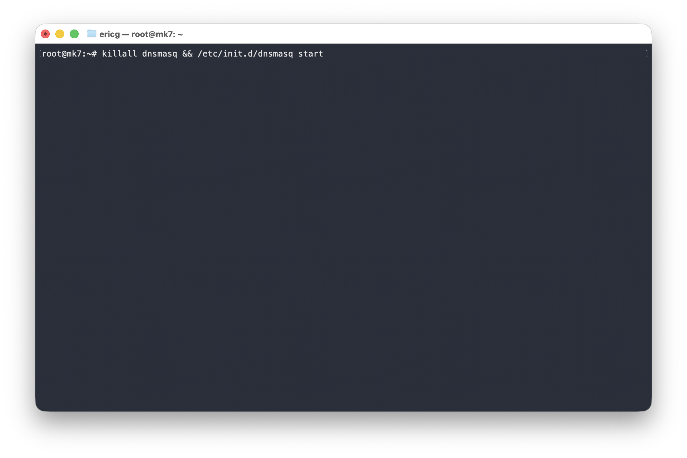

- Übernahme der vorgenommenen DNS-Änderungen auf dem WiFi Pineapple 
- Neustart des DNS-Dienstes, damit die neuen Zuordnungen wirksam werden 
- Sicherstellung, dass der DNS-Dienst aktiv läuft und Anfragen verarbeitet

### 6. Schritt: Überprüfung der DNS-Umleitung
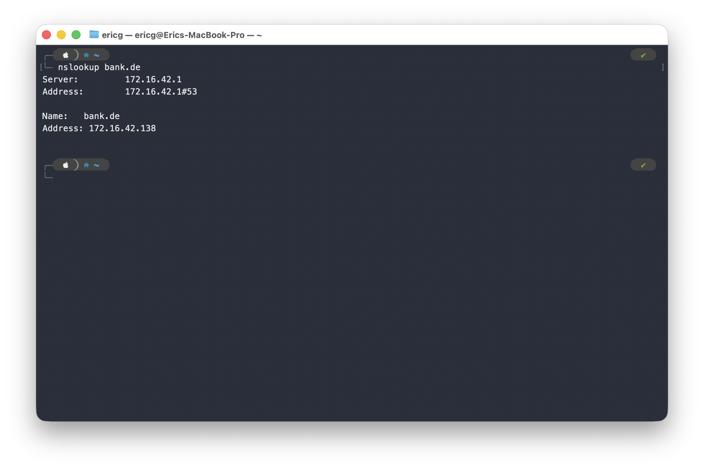

- Durchführung einer DNS-Abfrage für den definierten Domainnamen (bank.de) 
- Verwendung des Werkzeugs nslookup zur Überprüfung der Namensauflösung 
- Kontrolle, welcher DNS-Server die Anfrage beantwortet 
- Überprüfung, dass bank.de auf die IP-Adresse des eingerichteten Webservers aufgelöst wird

### 7. Schritt:  Simulation der Nutzerinteraktion
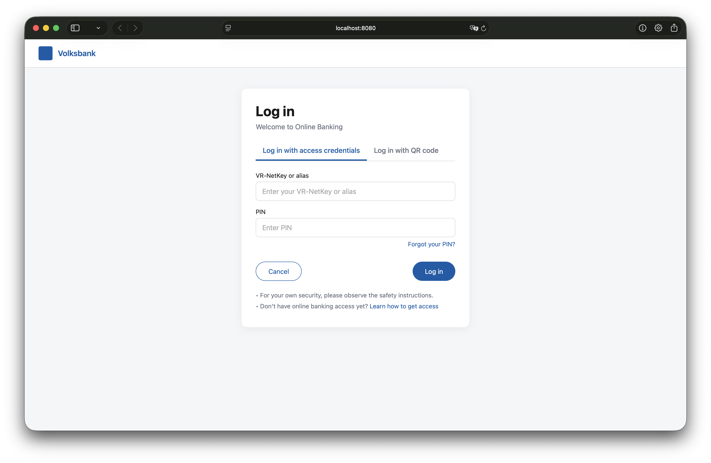

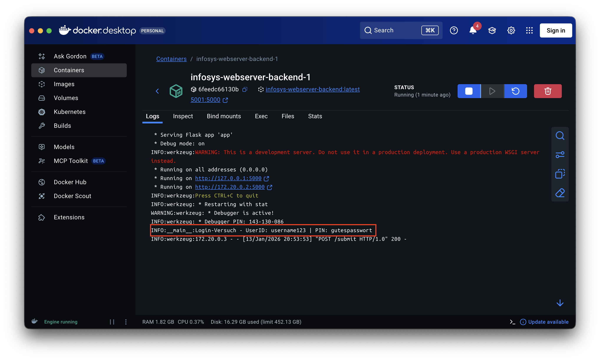

- Anzeige einer simulierten Login-Seite 
- Eingabe fiktiver Zugangsdaten in das Formular der Fake-HTML-Seite 
- Übermittlung der eingegebenen Testdaten an den angebundenen Webserver 
- Protokollierung der übermittelten Formularinhalte in den Server-Logs
- Auswertung der Logeinträge zur Bestätigung der korrekten Datenübertragung 

# Gegenmaßnahmen

## Gegenmaßnahmen gegen Deauthentication-Angriff

### WPA3 Einführen

WPA3 ist der neueste WLAN-Sicherheitsstandard und schützt Management-Frames kryptografisch. Dadurch können Deauth-Frames nicht mehr gefälscht werden, und der 4-Wege-Handshake wird nicht mitgeschnitten.

**Vorteile**

- Vollständiger Schutz vor Deauthentication-basierten MITM-Angriffen 
- Kein verwertbarer Handshake kann mehr abgefangen werden 
- Moderne Business-Access-Points unterstützen WPA3 bereits

**Kosten & Aufwand**

- Einmalige Hardware-Anpassung (neue Access-Points)
- Mehrkosten: 5–15% gegenüber WPA2-Geräten 
- Geringe Konfigurationsarbeit (1–2 Tage)

### Starkes WLAN-Passwort durchsetzen

Lange, komplexe Passwörter (mindestens 16 Zeichen, Sonderzeichen, Zahlen, Groß-/Kleinbuchstaben) sind schwer zu knacken, da sie nicht in Standard-Wortlisten enthalten sind.

**Vorteile**

- Hashcat benötigt deutlich länger zum Bruteforce 
- Kostenlos, keine technische Änderung nötig 
- Breitet auch andere Angriffe ab (z.B. Wörterbuch-Attacken)

**Kosten & Aufwand**

- Einmalige Richtlinie erstellen, sodass immer nur noch Passwörter im entsprechenden Format genutzt werden
- Adminaufwand für Passwortwechsel (vierteljährlich empfohlen) pro Jahr 

## Gegenmaßnahmen gegen DNS-Spoofing

### Port 80 (HTTP) in der Firewall blockieren

Unverschlüsselter HTTP-Verkehr wird auf der Firewall blockiert. Clients können nur noch über HTTPS (Port 443) auf Webseiten zugreifen. Gefälschte Seiten des Angreifers ohne gültiges SSL-Zertifikat werden vom Browser abgelehnt.

**Vorteile**

- DNS-Spoofing bringt dem Angreifer nichts, da HTTP-Verbindungen sowieso blockiert sind 
- Erzwingt verschlüsselte Kommunikation 
- Keine zusätzlichen Kosten, keine Admin-Komplexität

**Kosten & Aufwand**

- Firewall-Regel (5–10 Minuten Konfiguration) - Adminaufwand €

### DNSSEC einführen

DNS-Antworten werden kryptografisch signiert. Der Resolver prüft die Signatur und verwirft gefälschte Antworten automatisch.

**Vorteile**

- Technisch vollständiger Schutz gegen DNS-Manipulation 
- Funktioniert für alle Domains

**Kosten & Aufwand**

- Komplexe initiale Implementierung (mehrere Wochen)
- Hohes Schlüsselmanagement (Key-Rotation, Fehleranalyse)
- Laufender Admin-Aufwand: 3–5 Personentage/Jahr 
- Gesamtaufwand: Hoch (~5.000–10.000 €/Jahr), Nutzen: Sehr hoch aber disproportional 
- Empfehlung: NUR für kritische Infrastrukturen, nicht für KMU

# ROSI

## Ausgangslange & Annahmen

**Firma SWDS (angepasste, plausible Werte):**
- Jahresumsatz: 25 Mio. € 
- Personalkosten: 3 Mio. € 
- Betriebskosten: 6 Mio. € 
- 30 Mitarbeitende in Verwaltung/IT/Office 
- Produktion „Just in Time“ → Ausfallzeiten wirken sich direkt auf Umsatz aus

**Risiko A: Kompromittiertes WLAN (Deauth → Passwort → Einstieg ins Netz)**

- Angreifer nutzt Firmen-WLAN, lädt illegale Inhalte / führt Angriffe durch. 
- Mögliche Folgen:
  - Ermittlungen, Reputationsschaden, IT-Forensik, ggf. Produktionsunterbrechung.

Geschätzter Schaden im Ernstfall: **200.000 €**

- 50.000 € IT-Forensik, Rechtsberatung 
- 50.000 € Produktions-/Betriebsausfall 
- 100.000 € Reputationsschaden / Vertragsverluste (konservativ)

**Risiko B: DNS-Spoofing intern (Fake-Bank-Seite / Fake-Login)**

- Mitarbeitende geben Zugangsdaten ein, Angreifer greift auf Konten / Systeme zu.

Geschätzter Schaden im Ernstfall: **150.000 €**

- 50.000 € direkte finanzielle Verluste / Rückabwicklung 
- 50.000 € Betriebsstörung / Wiederherstellungsaufwand 
- 50.000 € Reputationsschaden

## Risikomatrix


| Risiko                 | Impact          | Likelihood       | Einstufung     | Erwarteter Jahresverlust EAL    |
|------------------------|-----------------|------------------|----------------|---------------------------------|
| WLAN-Komprimittierung  | Mittel (200k)   | Gering (3%)      | Mittel         | 0,03 × 200.000 € = 6.000 €/Jahr |
| DNS-Spoofing           | Mittel (150k)   | Sehr-Gering (1%) | Niedrig–Mittel | 0,01 × 150.000 € = 1.500 €/Jahr |

## Berechnungen

### WPA3 Einführen

**Annahmen zu Kosten**

- SWDS hat 10 Business-Access-Points. 
- Neuer WPA3-fähiger AP kostet 200 € statt 100 €. 
- Hardwarekosten gesamt: 10 × (200 – 100) € = 1.000 € Mehrkosten. 
- Installations-/Konfigurationsaufwand:
  - 1 IT-Admin-Tag à 500 € (Personalkosten + Overhead) → 500 €.

Gesamtinvestition 1.000 € + 500 € = **1.500 €**

**Risikoreduktion**

- Mit WPA3 (inkl. geschützten Management Frames) gilt:
  - Deauth-basierter Handshake-Mitschnitt praktisch nicht mehr möglich. 
  - Rest-Risiko nur noch durch andere Angriffswege (Social Engineering etc.).
- Konservativ:
  - EAL_vor (Expected Annual Loss) = 6.000 €/Jahr
  - EAL_nach = 600 €/Jahr (Restrestrisiko 10% des ursprünglichen)
  **- Risk Reduction = 90%**

$$
ROSI = \frac{0{,}9 \times 6.000 - 1.500}{1.500} \approx 2,6
$$

- **ROSI ≈ 260 %** → Jeder investierte Euro bringt im Erwartungswert 2,6 € zurück (in vermiedenen Schäden).

### Port 80 blockieren

**Annahmen zu Kosten**

- Anpassung der Firewall-Regel durch IT-Admin: 30 Minuten. 
- Stundensatz Admin: 60 € → 30 €. 
- Keine zusätzlichen Lizenz- oder Hardwarekosten.
  
Gesamtinvestition = **30 €**

**Risikoreduktion**

- Mit blockiertem HTTP:
  - Angreifer kann User noch auf Fake-Seite umleiten, aber:
    - Browser verweigert unverschlüsseltes HTTP. 
    - Zertifikatsfehler bei selbstsignierten/gefälschten HTTPS-Seiten.
- Konservativ:
  - EAL_vor = 1.500 €/Jahr
  - EAL_nach = 1.200 €/Jahr (Restrestrisiko 20% des ursprünglichen)
  **- Risk Reduction = 80%**

$$
ROSI = \frac{0{,}8 \times 1.500 - 30}{30} \approx 39
$$

- **ROSI ≈ 390 %** → Jeder investierte Euro bringt im Erwartungswert 39 € zurück (in vermiedenen Schäden).

### Starke WLAN-Passwörter

Falls WPA3 kurzfristig nicht umsetzbar ist, kann eine „Quick-Win“-Maßnahme separat bewertet werden.

**Annahmen zu Kosten**

- Anpassung des WLAN-Passworts durch IT-Admin: 30 Minuten.
- Stundensatz Admin: 60 € → 30 €.

Gesamtinvestition = **30 €**

**Risikoreduktion**

- Starkes Passwort ⇒ Handshake knacken per Wordlist/Bruteforce wird viel aufwendiger.
- Konservativ:
  - EAL_vor (Expected Annual Loss) = 6.000 €/Jahr
  - EAL_nach = 3.600 €/Jahr (Restrestrisiko 40% des ursprünglichen)
    **- Risk Reduction = 60%**

$$
ROSI = \frac{0{,}6 \times 6.000 - 30}{30} \approx 119
$$

- **ROSI ≈ 11.900 %** → Jeder investierte Euro bringt im Erwartungswert 119 € zurück (in vermiedenen Schäden).

## ROSI Übersicht

| Maßnahme           | Kosten  | RiskReduction | ROSI    | Empfehlung      |
| ------------------ |---------|---------------|---------| --------------- |
| WPA3 einführen     | 1.500 € | 90%           | 260%    | Sofort planen   |
| Port 80 blockieren | 30 €    | 80%           | 39%     | Sofort umsetzen |
| Starke Passwörter  | 30 €    | 60%           | 11.900% | Quick-Win       |

# Fazit

Dieses Projekt hat erfolgreich demonstriert, dass herkömmliche WPA2-Netzwerke ohne zusätzliche Schutzmaßnahmen (wie Management Frame Protection) anfällig für triviale Angriffe sind. 
In der isolierten Testumgebung konnte der vollständige Angriffsvektor – vom initialen Eindringen bis zur Datenexfiltration – reproduziert werden.

Die durchgeführte ROSI-Analyse verdeutlicht jedoch, dass Unternehmen diesen Risiken mit wirtschaftlich vertretbaren Mitteln begegnen können. 
Während die Einführung von WPA3 Investitionen in neue Hardware erfordern, bieten einfache Maßnahmen wie das Blockieren von unverschlüsseltem HTTP-Traffic oder die Durchsetzung 
komplexer Passwörter bereits einen enormen Sicherheitsgewinn bei minimalen Kosten.


Zusammenfassend zeigt das Projekt: Die Verteidigung erfordert daher keine "Wunderwaffen", sondern die konsequente Umsetzung grundlegender Sicherheitsstandards (WPA3, HTTPS-Only, Awareness).
